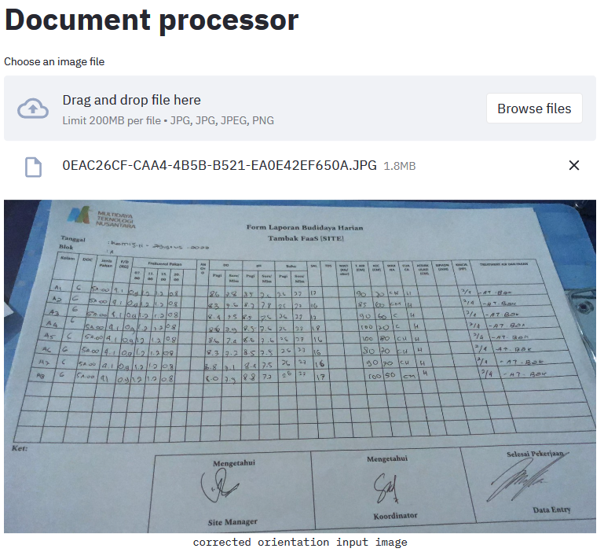
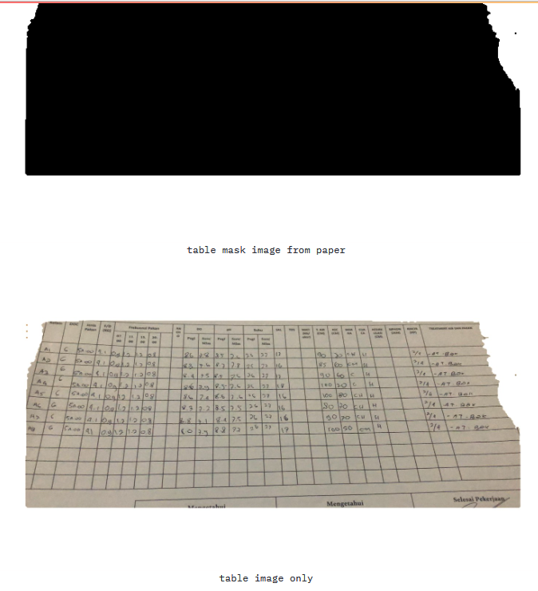
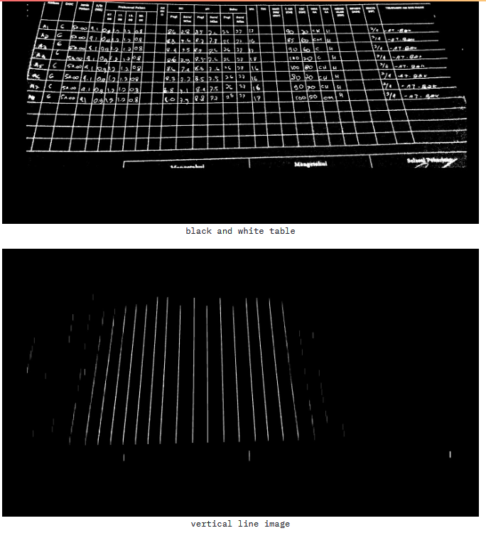
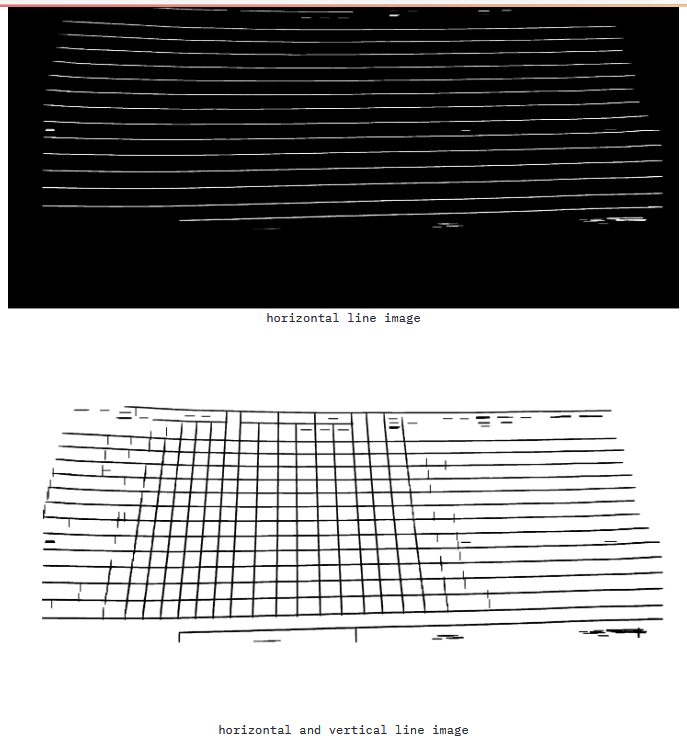
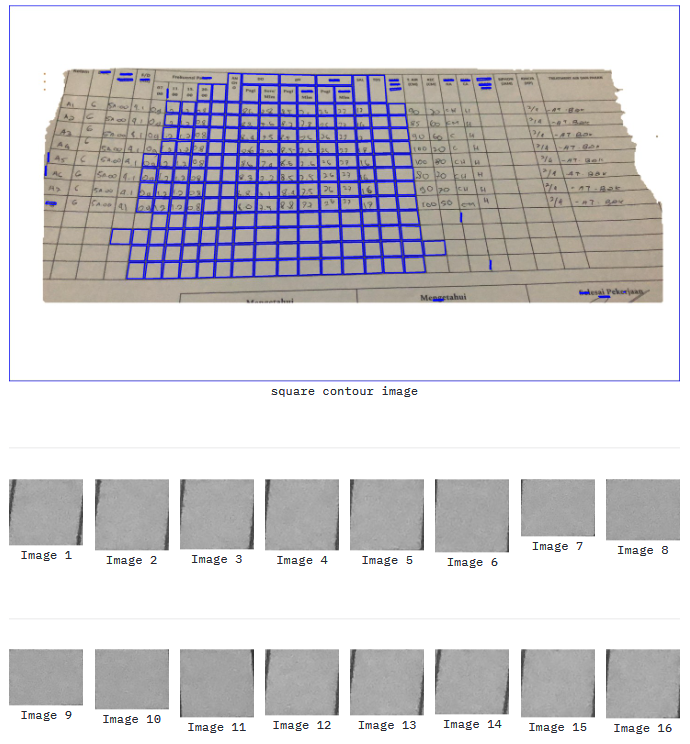
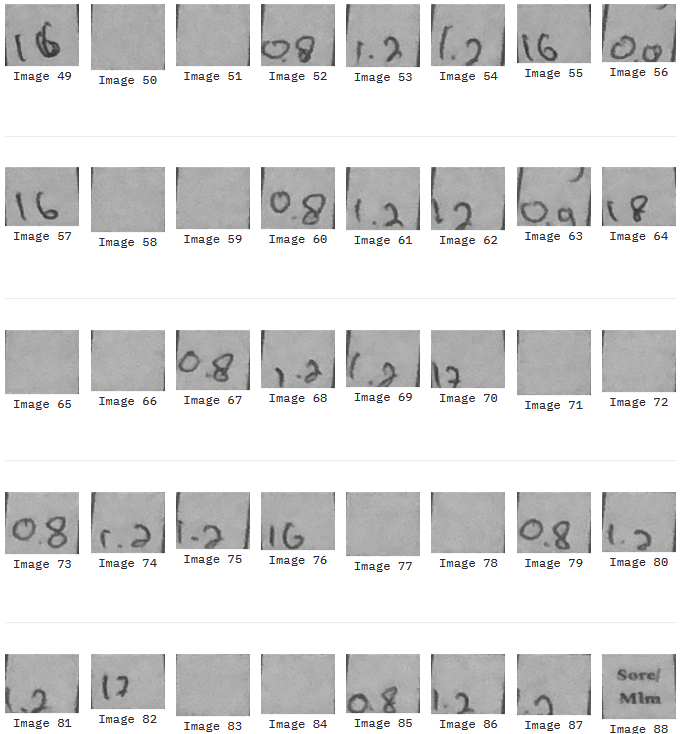

### How to run (docker & docker compose)
```bash
docker compose up #localhost:8501
```

Deskripsi permasalahan adalah melakukan document processing untuk mengekstrak informasi yang ada pada citra foto kertas form tabel berisi angka.

Dari sample gambar yang diberikan diketahui jika kesemua form memiliki format yang sama jadi susunan informasi yang ada didalamnya juga tidak berubah susunannya. Tugas utama yang perlu dilakukan adalah mengekstrak informasi yang ada pada setiap kolom table tersebut. Jika kita dapat mengidentifikasi kolom tabel dengan tepat maka informasi yang didapat juga dapat diekstrak untuk disusun kembali dengan cara melakukan pengenalan karakter pada setiap kolom tabel yang berhasil diidentifikasi. 





Yang perlu dilakukan pertama adalah mengetahui dimana lokasi tabel tersebut dalam pada gambar. Sebelumnya input gambar tersebut memiliki orientasi yang tidak sama jadi setelah dilakukan pembetulan orientasi (jika portrait ke landscape) maka citra siap untuk diolah. Metode yang bisa digunakan untuk mencari tahu region piksel yang mana yang merupakan tabel dapat dilakukan dengan metode instance segmentation. Untuk arsitektur yang bisa digunakan cukup beragam mulai dari Mask RCNN, FPN-Resnet, YOLO dan sebagainya. Untuk keperluan menjawab soal ini YOLOv8 saya gunakan untuk melakukannya, yang history training dan datasebt nya dapat dilihat pada link berikut ini: 

* CLEAR ML
> https://app.clear.ml/projects/508627c148e64934a7a988a04c8f122a/experiments/5972e53dffeb433d95b11b972d1ae0fa/output/execution
* Dataset (RoboFlow)
> https://universe.roboflow.com/bashatahamal/ocr-gdyqz/dataset/2

Setelah model untuk melakukan segmentasi terhadap tabel tersebut didapat maka tahap selanjutnya untuk mengekstrak informasi yang ada didalam tabel tersebut jadi lebih terfokus pada citra tabel itu saja. Sehingga dapat meminimalisir noise akibat object atau piksel lain yang terdapat pada gambar sebelum dilakukan segmentasi tabel. Mensegmentasi tabel untuk mendapatkan piksel area dari kolom tabel tersebut adalah hal yang selanjutnya dilakukan.

Melakukan operasi morphologi berupa erosi dengan kernel yang disesuaikan secara horizontal dan vertical dapat digunakan untuk mendapatkan garis pembentuk dari tabel. Sebelumnya saya juga mencoba metode vertical dan horizontal projection dengan konsep yang sama tetapi belum mendapatkan hasil yang maksimal. Dengan mendapatkan garis pembentuk tabel tersebut maka kita dapat melakukan deteksi kontur dari garis berpotongal horizontal dan vetical tersebut yang membentuk kontur persegi. Kontur persegi tersebut merupakan area kolom yang kemudian kita dapat ambil untuk dilakukan pengenalan karakter menggunakan model pengenalan karakter.
Dengan memotong-motong setiap tabel tersebut diharapkan dihasilkan hasil pengenalan karakter yang lebih akurat dan lebih dapat dipahami secara konteks mengenai posisinya dalam suatu dokumen. Dalam hal ini model machine learning yang saya latih sendiri hanya sampai untuk mensegmentasi tabel, demi efisiensi waktu maka saya memakai pretrained model pengenalan karakter angka MNIST dari library Keras Tensorflow. 

Dari hasil pengenalan pengenalan karakter tersebut dan dari posisi tabel mana dia diambil dapat disusun informasi dokumen secara utuh. Untuk implementasi teknis dari konsep yang saya jelaskan tadi memang belum sepenuhnya akurat, akan tetapi konsep dasar dan bagaimana cara yang bisa digunakan serta bagian mana yang bisa ditingkatkan lagi untuk mendapatkan hasil yang lebih baik saya coba terapkan pada folder berikut ini.






