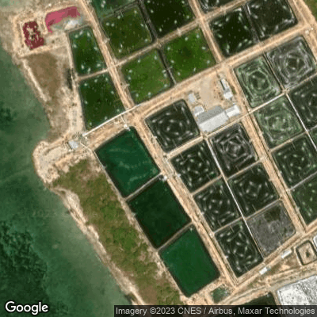
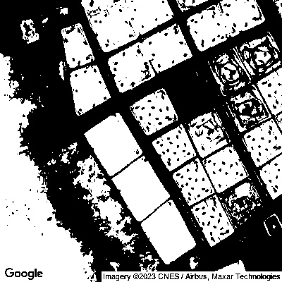
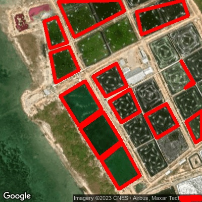

Dari permasalahan yang diberikan diketahui koordinat kolam dalam (latitude, longitude).

Tujuan utama adalah melakukan validasi / survey terhadap kolam secara tidak langsung.

Untuk mendapatkan informasi kolam dari koordinatnya saja, maka yang diubutuhkan adalah citra satelite lokasi koordinat kolam tersebut berada. Karena dengan mendapatkan citra kolam tersebut setidaknya informasi yang ingin kita ketahui dapat diekstraksi melalui citra tersebut. Dengan memanfaatkan Google Maps Static API dapat diperoleh citra satelite pada koordinat tertentu. Konsepnya adalah suatu kolam pasti memiliki tepian kolam yang apabila diambil gambarnya dari atas akan membentuk suatu objek tertentu. Perbedaan tepian kolam dengan sekelilingnya atau dengan kolam lain / objek lain didekatnya akan membentuk suatu kontur yang terlihat dalam citra. 



Yang perlu dilakukan adalah mendeteksi kontur tepian kolam tersebut untuk didapat bentuk objek kolam. Dari kontur kolam tersebut dapat diperoleh informasi panjang kolam dengan membandingkan ratio panjang piksel kontur kolam dengan nilai piksel per meter pada kenyataannya. Nilai piksel per meter diperoleh dari rumus dalam penggunaan Google Maps Static API dengan masukan berupa latitude dan zoom level yang digunakan saat mendapatkan citra satelite. 

```python
156543.03392 * Math.cos(latitude * Math.PI / 180) / Math.pow(2, zoom_level)
```
Pendeteksian kontur kolam tersebut dalam dilakukan dengan beberapa tahapan preprocessing terlebih dahulu untuk mendapatkan hasil yang maksimal seperti pendeteksian tepi, operasi morphologi piksel erosi, dilasi, opening, closing baru kemudian dicari kontur kolam tersebut misalnya menggunakan library opencv. Dari kontur kolam yang didapat tersebut kemudian dapat dihitung luas area sebenarnya dengan mengacu pada ukuran ratio piksel per meter.





Untuk keperluan menjawab soal ini saya melakukan beberapa simplifikasi terhadap teknis penyelesaian dari permasalahan di atas. Misalnya dalam teknis preprocessing saya langsung melakukan pendeteksian kontur dari gambar binary dan kontur yang saya ambil adalah bentuk kontur segi empat untuk didapat 2 sisi terpanjang dari tepian kolam untuk dikalikan dan didapat luasnya dengan penghitungan luas area kolam saya anggap berbentuk persegi .

> File **Maps.ipynb** dapat dijalankan di Google Colaboratory

Dari penyelesaian tersebut pendeteksian kontur yang lebih akurat dan perhitungan luas kolam bisa ditingkatkan dari sisi detail teknis untuk mendapatkan hasil yang lebih baik lagi. Alternatif lain yang dapat digunakan untuk mendapatkan area kolam adalah melakukan instance segmentation seperti yang saya lakukan untuk nomor 1 dan 3. Konsepnya kurang lebih sama yaitu untuk mencari kolam dalam citra tersebut direpresentasikan oleh piksel yang mana dan dihitung ukuran sebenernya. 
