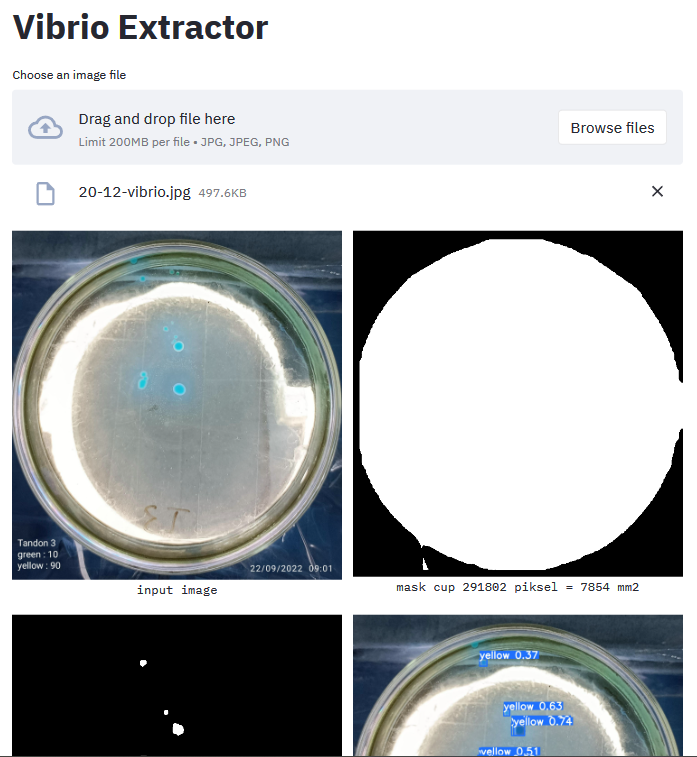
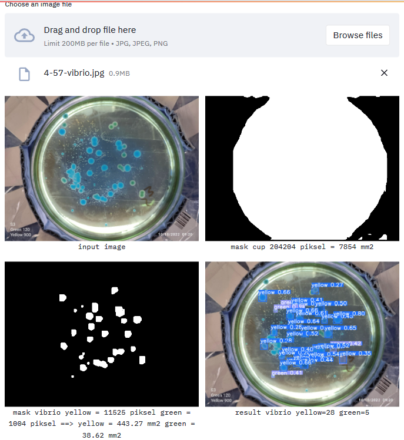
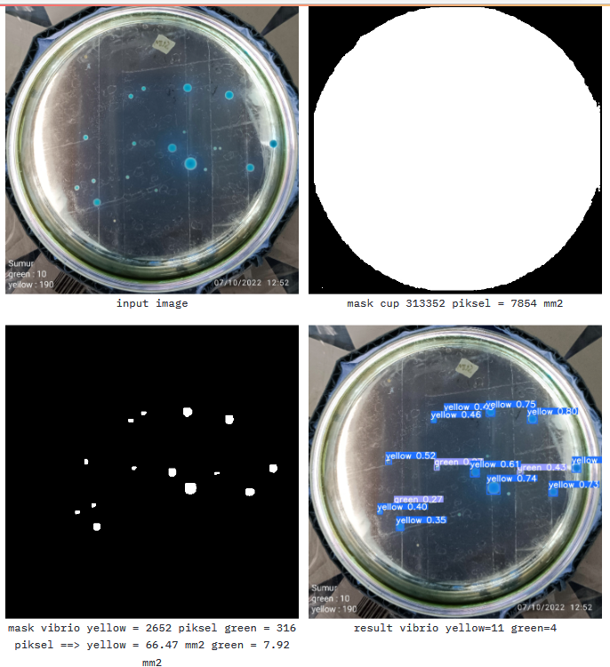

### How to run (docker & docker compose)
```bash
docker compose up #localhost:8501
```

Deskripsi permasalahan adalah melakukan ektraksi informasi berupa jumlah, ukuran dan warna dari suatu citra cawan petri berisi vibrio.

Dari sample gambar yang diberikan merupakan gambar citra cawan petri dari arah atas secara tegak lurus dengan diketahui luasannya yaitu 7854 mm2. Dengan informasi luasan cawan petri tersebut, maka jika bisa diketaui luasan piksel dari objek masing masing vibrio yang ada, dapat diketahui pula ukuran vibrio tersebut dengan cara melakukan perbandingan ratio jumlah piksel yang membentuk objek cawan petri dengan jumlah piksel yang membentuk objek vibrio.

Untuk dapat menyelesaikan hal tersebut maka dibutuhkan segmentasi terhadap dua objek utama yaitu segmentasi area lingkaran cawan petri dan segmentasi area objek vibrio. Berdasarkan jenis objek vibrio yang ada maka segmentasi murni berdasarkan warna saja tidak dapat menghasilkan hasil yang optimal oleh karena itu dapat digunakan metode segmentasi menggunakan instance segmentation untuk didapat objek dengan area piksel yang berkesesuaian. Selanjutnya untuk objek vibrio selain dibutuhkan segmentasi dibutuhkan juga klasifikasi terhadap hasil segmentasi tersebut untuk dapat dibedakan jenis vibrio kuning, hijau atau hitam.

Dari penjabaran tersebut maka metode yang efektif dapat diterapkan untuk permasalahan ini salah satunya adalah Yolov8 karena selain dapat digunakan untuk melakukan object recognition dapat juga digunakan sebagai instance segmentation. Berikut link pembuatan dataset dari objek cawan petri dan vibrio beserta history trainingnya pada ClearML:

* Cawan Petri
> https://universe.roboflow.com/bashatahamal/petri-6ku2d/dataset/1
> https://app.clear.ml/projects/ecc173501e504affb5cb7e64bda9febf/experiments/910db09084e9419780d65baadd01b45e/output/execution

* Vibrio
> https://universe.roboflow.com/bashatahamal/vibrio-ygplo/dataset/3
> https://app.clear.ml/projects/c4c429d6a0d24c42a34ac7e860bf5d8c/experiments/5967a3193d0340aeb789887ff833b96f/output/execution (untuk latest training historinya tidak sengaja terhapus)




Dari dua hasil proses instance segmentasi menggunakan Yolov8 untuk vibrio dan cawan petrinya secara terpisah, didapat luasan area piksel yang dapat digunakan untuk mengukur luasan sebenarnya dalam mm2. Objek vibrio per jenis nya juga dapat diketahui. Dari pecrcobaan didapati hasil akhir berupa jumlah vibrio per jenisnya beserta ukurannya masing masing dala mm2. Meskipun hasil akhir model belom memiliki akurasi yang cukup tinggi akan tetapi konsep dasar yang dapat dipakai untuk menyelesaikan masalah ini saya rasa sudah cukup memenuhi. Dapat ditingkatkan lagi dari sisi akurasi pembuatan dataset serta model training untuk objek vibrio yang lebih variatif untuk  bisa didapat hasil pengenalan yang lebih optimal.






